# SETTL.

**Stripe-like invoices on-chain, instantly.**


SETTL is a Stripe-like invoice link that turns accounts receivable into RealFi rails on Mantle: businesses get paid in stablecoins, unlock instant financing against invoices/cashflows, and build an on-chain reputation that improves terms over time.

For a detailed introduction, see [INTRO.md](./INTRO.md).

---

## 🏗️ Architecture

### System Overview

```mermaid
graph TB
    subgraph "User Layer"
        Seller[👤 Seller<br/>Business]
        Buyer[👤 Buyer<br/>Customer]
        LP[💰 Liquidity Provider<br/>LP]
        Admin[⚙️ Protocol Admin<br/>Treasury]
    end

    subgraph "Frontend Layer"
        React[⚛️ React + TypeScript]
        Privy[🔐 Privy<br/>Embedded Wallets]
        Wagmi[🔗 Wagmi<br/>Web3 Hooks]
        Reclaim[🔒 Reclaim Protocol<br/>zkTLS Proofs]
        
        React --> Privy
        React --> Wagmi
        React --> Reclaim
    end

    subgraph "Mantle Network (L2)"
        subgraph "Invoice System"
            InvoiceRegistry[📋 InvoiceRegistry<br/>State Management]
            InvoiceNFT[🎨 InvoiceNFT<br/>ERC721 NFT]
            
            InvoiceRegistry -->|Mints| InvoiceNFT
        end
        
        subgraph "Financing System"
            Vault[🏦 Vault<br/>Liquidity Pool]
            USMTPlus[🪙 USMT+<br/>ERC20 Receipt]
            Staking[📊 Staking<br/>Yield Position]
            AdvanceEngine[⚡ AdvanceEngine<br/>Instant Financing]
            
            Vault -->|Mints 1:1| USMTPlus
            USMTPlus -->|Stake| Staking
            AdvanceEngine -->|Borrows| Vault
            AdvanceEngine -.->|Uses as Collateral| InvoiceNFT
        end
        
        subgraph "Settlement System"
            SettlementRouter[💸 SettlementRouter<br/>Payment Waterfall]
            Reputation[⭐ Reputation<br/>Credit Score]
            
            SettlementRouter -->|Updates| InvoiceRegistry
            SettlementRouter -->|Updates| Reputation
            SettlementRouter -->|Repays| Vault
        end
        
        DemoUSDC[💵 DemoUSDC<br/>ERC20 Stablecoin]
    end

    Seller -->|Creates Invoice| React
    Buyer -->|Pays Invoice| React
    LP -->|Deposits/Stakes| React
    Admin -->|Manages| React

    React -->|Web3 Calls| InvoiceRegistry
    React -->|Web3 Calls| Vault
    React -->|Web3 Calls| Staking
    React -->|Web3 Calls| AdvanceEngine
    React -->|Web3 Calls| SettlementRouter

    InvoiceRegistry -.->|Checks Status| AdvanceEngine
    AdvanceEngine -.->|Updates Status| InvoiceRegistry
    SettlementRouter -.->|Updates Status| InvoiceRegistry
    
    SettlementRouter -->|Fee| Admin
    SettlementRouter -->|Remainder| Seller
    
    style Seller fill:#2563eb,stroke:#1e40af,stroke-width:2px,color:#fff
    style Buyer fill:#2563eb,stroke:#1e40af,stroke-width:2px,color:#fff
    style LP fill:#f59e0b,stroke:#d97706,stroke-width:2px,color:#fff
    style Admin fill:#dc2626,stroke:#b91c1c,stroke-width:2px,color:#fff
    style React fill:#6366f1,stroke:#4f46e5,stroke-width:2px,color:#fff
    style Privy fill:#8b5cf6,stroke:#7c3aed,stroke-width:2px,color:#fff
    style Wagmi fill:#8b5cf6,stroke:#7c3aed,stroke-width:2px,color:#fff
    style Reclaim fill:#8b5cf6,stroke:#7c3aed,stroke-width:2px,color:#fff
    style InvoiceRegistry fill:#10b981,stroke:#059669,stroke-width:2px,color:#fff
    style InvoiceNFT fill:#10b981,stroke:#059669,stroke-width:2px,color:#fff
    style Vault fill:#f59e0b,stroke:#d97706,stroke-width:2px,color:#fff
    style USMTPlus fill:#f59e0b,stroke:#d97706,stroke-width:2px,color:#fff
    style Staking fill:#06b6d4,stroke:#0891b2,stroke-width:2px,color:#fff
    style AdvanceEngine fill:#f59e0b,stroke:#d97706,stroke-width:2px,color:#fff
    style SettlementRouter fill:#ef4444,stroke:#dc2626,stroke-width:2px,color:#fff
    style Reputation fill:#06b6d4,stroke:#0891b2,stroke-width:2px,color:#fff
    style DemoUSDC fill:#6b7280,stroke:#4b5563,stroke-width:2px,color:#fff
```



### Invoice Lifecycle Flow


### Liquidity Provider Flow


### Settlement Waterfall


---

## 🚀 Quick Start

### Prerequisites

- **Node.js** 18+ and npm (install via [nvm](https://github.com/nvm-sh/nvm#installing-and-updating))
- **Git** for cloning the repository
- **Hardhat** (installed automatically with dependencies)
- **Mantle Network** testnet access (Mantle Sepolia)
- **Wallet** with testnet ETH for gas fees

### Installation

```bash
# 1. Clone the repository
git clone https://github.com/Adityaakr/SETTL..git
cd SETTL.

# 2. Install dependencies
npm install

# 3. Set up environment variables
cp .env.example .env  # Create .env file and fill in your values

# 4. Start development server
npm run dev
```

The development server will start on `http://localhost:8080`

---

## 📋 Detailed Setup Instructions

### Step 1: Clone Repository

```bash
git clone https://github.com/Adityaakr/SETTL..git
cd SETTL.
```

### Step 2: Install Dependencies

```bash
npm install
```

This installs:
- Frontend dependencies (React, Vite, TypeScript, Wagmi, etc.)
- Smart contract dependencies (Hardhat, Ethers.js, OpenZeppelin)
- All required packages listed in `package.json`

### Step 3: Environment Configuration

Create a `.env` file in the root directory by copying `.env.example`:

```bash
cp .env.example .env
```

Then fill in your environment variables. See `.env.example` for all required variables.

**Required Environment Variables:**

- `VITE_PRIVY_APP_ID` - Get from [Privy Dashboard](https://dashboard.privy.io/)
- `VITE_MANTLE_CHAIN_ID` - Set to `5003` for Mantle Sepolia
- `DEPLOYER_PRIVATE_KEY` - Your wallet private key for deploying contracts
- `VITE_RECLAIM_APP_ID` - (Optional) For zkTLS proofs via Reclaim Protocol

Contract addresses will be populated after deployment.

**Important:** Never commit your `.env` file to version control. It's already included in `.gitignore`.

### Step 4: Get Testnet ETH

To deploy contracts and interact with the protocol, you need Mantle Sepolia testnet ETH:

1. Get testnet ETH from [Mantle Faucet](https://faucet.sepolia.mantle.xyz/)
2. Add Mantle Sepolia network to your wallet:
   - **Network Name:** Mantle Sepolia
   - **RPC URL:** https://rpc.sepolia.mantle.xyz
   - **Chain ID:** 5003
   - **Currency Symbol:** ETH
   - **Block Explorer:** https://explorer.testnet.mantle.xyz

---

## 🏗️ Smart Contract Deployment

### Deploy All Contracts

Deploy all smart contracts to Mantle Sepolia testnet:

```bash
# Compile contracts first (optional, deploy script will compile)
npm run compile

# Deploy all contracts
npm run deploy
```

**What gets deployed:**
1. **DemoUSDC** - Demo USDC token for testing
2. **InvoiceNFT** - ERC721 NFT contract for tokenized invoices
3. **InvoiceRegistry** - Invoice creation and state management
4. **Vault** - Liquidity pool for invoice financing
5. **AdvanceEngine** - Instant financing engine
6. **Reputation** - On-chain credit scoring system
7. **SettlementRouter** - Automated payment settlement
8. **USMTPlus** - Receipt token for vault deposits
9. **Staking** - Staking contract for sUSMT+ tokens

**Deployment Output:**

The script will:
- Deploy all contracts in the correct order
- Configure roles and permissions between contracts
- Save contract addresses to `contracts.json`
- Display environment variables to add to `.env`

**Example Output:**

```
✅ Deployment complete!

Contract addresses saved to: contracts.json

VITE_INVOICE_NFT_ADDRESS=0x...
VITE_INVOICE_REGISTRY_ADDRESS=0x...
VITE_VAULT_ADDRESS=0x...
VITE_ADVANCE_ENGINE_ADDRESS=0x...
VITE_REPUTATION_ADDRESS=0x...
VITE_SETTLEMENT_ROUTER_ADDRESS=0x...
```

Copy these addresses to your `.env` file.

### Verify Contracts (Optional)

After deployment, verify contracts on Mantle Explorer:

```bash
# Set your Mantle Etherscan API key in .env
MANTLE_ETHERSCAN_API_KEY=your_api_key

# Verify contracts
npm run verify
```

This requires:
1. Mantle Etherscan API key (get from [Mantle Explorer](https://explorer.testnet.mantle.xyz))
2. Contracts to be fully confirmed on-chain

### Manual Deployment (Advanced)

For more control, deploy contracts individually:

```bash
# Using Hardhat console
npx hardhat console --network mantleSepolia

# Or create custom deployment script
# See scripts/deploy-all.ts for reference
```

---

## 🎨 Frontend Deployment

### Development Mode

```bash
npm run dev
```

Starts Vite dev server with hot reload on `http://localhost:8080`

### Production Build

```bash
# Build for production
npm run build

# Preview production build locally
npm run preview

### Testing the Complete Flow

1. **Deploy Contracts:**
   ```bash
   npm run deploy
   ```

2. **Start Frontend:**
   ```bash
   npm run dev
   ```

3. **Fund Wallets:**
   - Use Settings → Demo Setup to mint DemoUSDC
   - Fund test wallets with DemoUSDC

4. **Test Invoice Flow:**
   - Create invoice as Seller
   - Request advance (optional)
   - Pay invoice as Buyer
   - Verify settlement waterfall

---

## 📚 Architecture Overview

### Smart Contracts

```
InvoiceRegistry
    ├── Creates invoices
    └── Mints InvoiceNFT (ERC721)

InvoiceNFT
    └── Represents tokenized invoices

Vault
    ├── Accepts LP deposits (USDC)
    ├── Mints USMT+ (1:1 receipt token)
    └── Provides liquidity for advances

Staking
    ├── Accepts USMT+ deposits
    ├── Mints sUSMT+ (staked receipt token)
    └── Targets 15-25% APY yield

AdvanceEngine
    ├── Uses InvoiceNFT as collateral
    └── Borrows from Vault

SettlementRouter
    ├── Handles invoice payments
    ├── Executes settlement waterfall:
    │   ├── Protocol fee (0.5%)
    │   ├── Vault repayment (if financed)
    │   └── Seller remainder
    └── Updates Reputation

Reputation
    └── Tracks on-chain credit scores
```

### Frontend Architecture

```
React + TypeScript
    ├── Privy (Embedded Wallets)
    ├── Wagmi (Web3 Interactions)
    └── Reclaim Protocol (zkTLS proofs - optional)
```

## 🔐 Security Considerations

### For Users

- **Non-Custodial:** SETTL does not hold user funds; all transactions are on-chain
- **Smart Contracts:** All contracts use OpenZeppelin libraries and best practices
- **Audits:** Contracts should be audited before mainnet deployment
- **Testnet Only:** Current deployment is on Mantle Sepolia testnet

### For Developers

- **Private Keys:** Never commit private keys to version control
- **Environment Variables:** Keep `.env` secure and never share it
- **Contract Upgrades:** Current contracts are not upgradeable (immutable)
- **Access Control:** Uses OpenZeppelin's AccessControl for role-based permissions

---

## 🤝 Contributing

SETTL is currently in active development. For contributions:

1. Fork the repository
2. Create a feature branch
3. Make your changes
4. Test thoroughly
5. Submit a pull request

---

## 📄 License

© 2024 SETTL.. All rights reserved.

---

## 🌐 Learn More

- **Introduction:** See [INTRO.md](./INTRO.md) for project overview and pitch
- **Contact:** Telegram @Adityaakrx | Twitter @adityakrx
